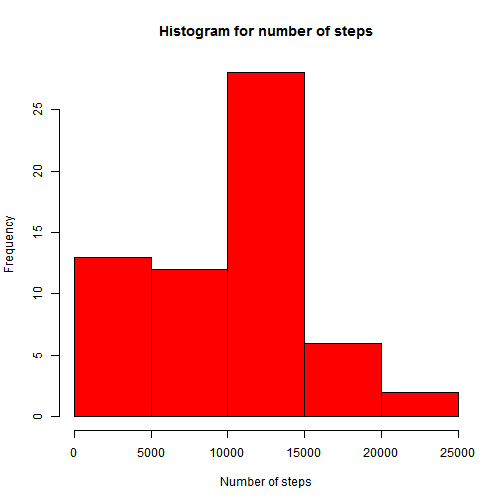
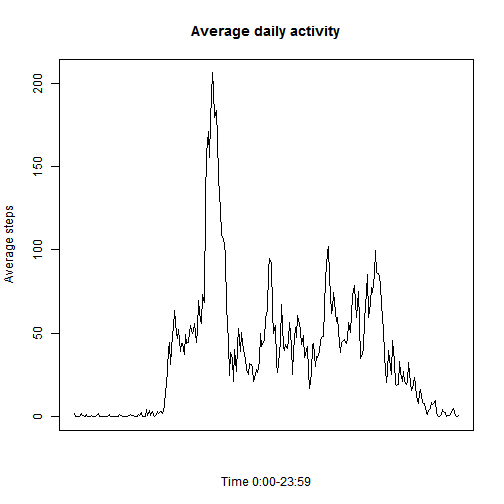
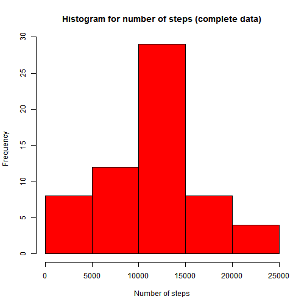
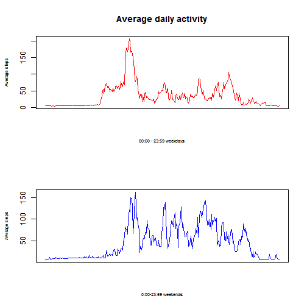

## Loading and preprocessing the data

The analysis is based on activity data provided in [GitHub repository] (https://github.com/rdpeng/RepData_PeerAssessment1) for the Reproducible Research 1st assignment. The file contains number of steps recorded daily in 5 minutes intervals. To simplify, assume the file is downloaded and available in working directory.  

```r
WD <- getwd()
if (!is.null(WD)) setwd(WD)
dataRR<-read.csv("activity.csv",header=T)
```

## What is mean total number of steps taken per day?

Before calculating any summary statistics, it is recommended to visualise the data - below histogram of total steps per day. 

```r
hist(tapply(dataRR$steps,dataRR$date,sum,na.rm=TRUE),main="Histogram for number of steps",xlab="Number of steps",ylab="Frequency",col="red")
```

 

To calculate mean and median of total number of steps per day, missing values have been removed: 

Mean: 

```r
mean(tapply(dataRR$steps,dataRR$date,sum,na.rm=TRUE))
```

```
## [1] 9354.23
```

Median: 

```r
median(tapply(dataRR$steps,dataRR$date,sum,na.rm=TRUE))
```

```
## [1] 10395
```


## What is the average daily activity pattern?

Average daily activity pattern (excluding missing data) is displayed below:


```r
plot(0:287,tapply(dataRR$steps,dataRR$interval,mean,na.rm=TRUE),"l", main="Average daily activity", xlab="Time 0:00-23:59",ylab="Average steps", xaxt="n")
```

 

Maximum average number of steps is reached in the interval displayed below (it should be read as H:MM), second result is the index of the interval. 

```r
which.max(tapply(dataRR$steps,dataRR$interval,mean,na.rm=TRUE))
```

```
## 835 
## 104
```

## Imputing missing values

The data in the file is incomplete, total number of incomplete rows is: 


```r
nrow(dataRR)-sum(complete.cases(dataRR))
```

```
## [1] 2304
```

The missing data are all in the number of steps.
One of the possibilities to fill in the missing data is to use average number of steps for the interval. This is done by first calculating the average, then merging the original file with the average data and replacing "NA" with calculated average.


```r
na_values<-tapply(dataRR$steps,dataRR$interval,mean,na.rm=TRUE)
temp<-merge(dataRR,na_values,by.x="interval", by.y=0,all.x=TRUE)
data_compl<-dataRR
data_compl$steps<-ifelse(is.na(dataRR$steps),temp$y,dataRR$steps)
```

Mean and median can be now calculated without the need to omit missing values. 
Mean: 

```r
mean(tapply(data_compl$steps,data_compl$date,sum))
```

```
## [1] 10889.8
```
Median: 

```r
median(tapply(data_compl$steps,data_compl$date,sum))
```

```
## [1] 11015
```

For comparison, histogram of total number of steps with completed data. As clearly shown on the graph, skewness has been greatly reduced and data looks much more normal now: 

```r
hist(tapply(data_compl$steps,data_compl$date,sum),main="Histogram for number of steps (complete data)",xlab="Number of steps",ylab="Frequency",col="red")
```

 


## Are there differences in activity patterns between weekdays and weekends?
To analyse differences between weekdays and weekends, first additional variable is created to separate the two categories. 

```r
data_compl$day<-weekdays(as.Date(data_compl$date),abbreviate=FALSE)
data_compl$day<-ifelse((data_compl$day=="Saturday" | data_compl$day=="Sunday"),"weekend","weekday")
```

The easiest way to compare the activity over weekdays and weekends is to show the average pattern on one graph:


```r
data_compl1<-data_compl[data_compl$day=="weekday",]
data_compl2<-data_compl[data_compl$day=="weekend",]
par(mfrow=c(2,1))
plot(0:287,tapply(data_compl1$steps,data_compl1$interval,mean),"l", main="Average daily activity",xlab="00:00 - 23:59 weekdays",ylab="Average steps", xaxt="n", col="red", cex.lab=0.6)
plot(0:287,tapply(data_compl2$steps,data_compl2$interval,mean),"l",xlab="0:00-23:59 weekends",ylab="Average steps", xaxt="n", col="blue", cex.lab=0.6)
```

 

As shown, the activity starts later on weekends, but there are several peaks afterwards. On weekedays after the peak during morning, the rest of the day seems to be quieter. 

